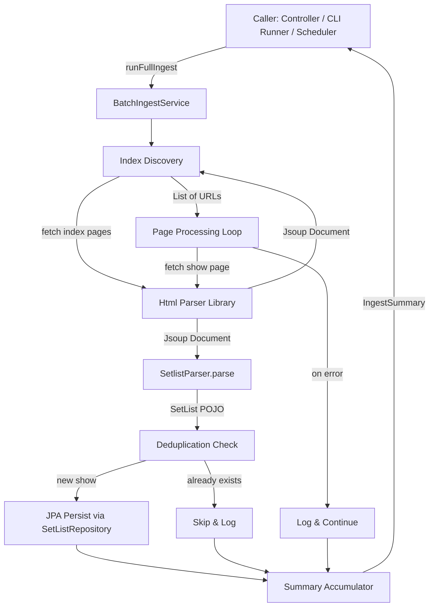
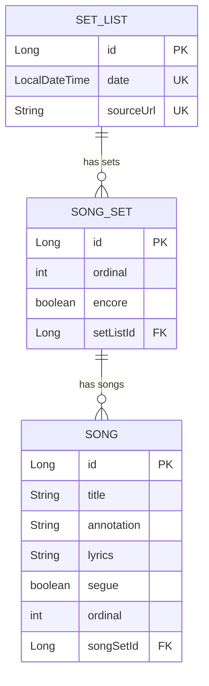

# Design Document: Setlist Batch Ingest

## Overview

This design describes the batch ingestion pipeline that crawls all Grateful Dead setlists from setlist.fm, parses each show page using the existing `SetlistParser`, and persists the resulting `SetList` → `SongSet` → `Song` entity graph into MySQL via Spring Data JPA.

The pipeline is a single-threaded, synchronous process exposed as a Spring bean method (`runFullIngest()`). It follows a linear flow: discover URLs → fetch pages → parse → deduplicate → persist → summarize. Resilience is achieved through per-show error isolation — failures are logged and counted but never halt the run. Rate limiting between HTTP requests keeps the process respectful of setlist.fm's servers.

The existing plain-Lombok POJOs (`SetList`, `SongSet`, `Song`) are promoted to JPA entities with generated keys, cascade relationships, and unique constraints for natural-key deduplication.

## Architecture



### Key Design Decisions

1. **Synchronous single-threaded execution** — The rate-limiting requirement (1 request/sec default) means concurrency adds complexity without significant throughput gain. The method blocks the caller; async invocation is the caller's responsibility.

2. **Per-show transaction isolation** — Each show is persisted in its own transaction (`@Transactional(propagation = REQUIRES_NEW)`) so that a persistence failure on one show does not roll back others.

3. **Dual natural-key deduplication** — Shows are identified by both `date` (full `LocalDateTime` precision) and `sourceUrl`. Either match triggers a skip.

4. **Guard against concurrent runs** — An `AtomicBoolean` flag prevents overlapping invocations; the second caller receives an immediate rejection.

5. **Non-blocking delay** — `Thread.sleep` is acceptable here because the batch runs on its own thread; it does not hold a web-server request thread. The caller (controller or CLI) can invoke the batch asynchronously via `@Async` or `CompletableFuture.supplyAsync()` if needed.

## Components and Interfaces

### BatchIngestService

```java
@Service
public class BatchIngestService {

    /**
     * Executes the full ingest pipeline synchronously.
     * @return IngestSummary with discovered/ingested/skipped/failed counts
     * @throws IngestAlreadyRunningException if another run is in progress
     */
    public IngestSummary runFullIngest();
}
```

**Dependencies (injected):**
- `SetlistIndexCrawler` — discovers all setlist page URLs
- `SetlistParser` — parses Document → SetList (existing component)
- `SetListRepository` — Spring Data JPA repository for persistence
- `HtmlParserClient` — thin wrapper around the `html-parser` library for fetching Documents
- `BatchIngestProperties` — `@ConfigurationProperties` bean for `batch.ingest.*`

### SetlistIndexCrawler

```java
@Component
public class SetlistIndexCrawler {

    /**
     * Fetches all index pages starting from the configured base URL,
     * follows pagination, and returns a deduplicated list of show URLs.
     */
    public List<String> discoverSetlistUrls();
}
```

Responsible for:
- Fetching the base index page via `HtmlParserClient`
- Extracting pagination links and following them
- Extracting individual setlist page links from each index page
- Deduplicating by full URL string
- Applying rate-limit delay between page fetches
- Logging and skipping on index page failures

### HtmlParserClient

```java
@Component
public class HtmlParserClient {

    /**
     * Fetches the given URL via the html-parser library and returns a Jsoup Document.
     * @throws HtmlFetchException on network error, HTTP error, or timeout
     */
    public Document fetch(String url);
}
```

Thin adapter around the existing `kfm:html-parser` dependency. Encapsulates timeout configuration and provides a consistent exception type.

### BatchIngestProperties

```java
@ConfigurationProperties(prefix = "batch.ingest")
@Validated
public class BatchIngestProperties {
    private String indexUrl;

    @Min(100) @Max(60000)
    private int requestDelayMs = 1000;
}
```

Validated on startup — invalid `requestDelayMs` prevents application context creation.

### IngestSummary

```java
public record IngestSummary(int discovered, int ingested, int skipped, int failed) {}
```

Returned by `runFullIngest()`. Immutable value object.

### SetListRepository

```java
public interface SetListRepository extends JpaRepository<SetList, Long> {
    boolean existsByDate(LocalDateTime date);
    boolean existsBySourceUrl(String sourceUrl);
}
```

### Concurrency Guard

`BatchIngestService` holds a private `AtomicBoolean running` field. On entry to `runFullIngest()`, it attempts `compareAndSet(false, true)`; on failure it throws `IngestAlreadyRunningException`. A `finally` block resets the flag.

## Data Models

### Entity Relationship Diagram



### SetList Entity

```java
@Entity
@Table(name = "set_list", uniqueConstraints = {
    @UniqueConstraint(name = "uk_set_list_date", columnNames = "date"),
    @UniqueConstraint(name = "uk_set_list_source_url", columnNames = "source_url")
})
@Data @Builder @NoArgsConstructor @AllArgsConstructor
public class SetList {

    @Id @GeneratedValue(strategy = GenerationType.IDENTITY)
    private Long id;

    @Column(nullable = false)
    private LocalDateTime date;

    @Column(name = "source_url", nullable = false, length = 2048)
    private String sourceUrl;

    @OneToMany(mappedBy = "setList", cascade = {CascadeType.PERSIST, CascadeType.MERGE},
               orphanRemoval = true)
    @OrderBy("ordinal")
    @Builder.Default
    private List<SongSet> songSets = new ArrayList<>();
}
```

### SongSet Entity

```java
@Entity
@Table(name = "song_set")
@Data @Builder @NoArgsConstructor @AllArgsConstructor
public class SongSet {

    @Id @GeneratedValue(strategy = GenerationType.IDENTITY)
    private Long id;

    private int ordinal;

    @Builder.Default
    private boolean encore = false;

    @ManyToOne(fetch = FetchType.LAZY)
    @JoinColumn(name = "set_list_id", nullable = false)
    private SetList setList;

    @OneToMany(mappedBy = "songSet", cascade = {CascadeType.PERSIST, CascadeType.MERGE},
               orphanRemoval = true)
    @OrderBy("ordinal")
    @Builder.Default
    private List<Song> songs = new ArrayList<>();
}
```

### Song Entity

```java
@Entity
@Table(name = "song")
@Data @Builder @NoArgsConstructor @AllArgsConstructor
public class Song {

    @Id @GeneratedValue(strategy = GenerationType.IDENTITY)
    private Long id;

    @Column(nullable = false)
    private String title;

    @Column(columnDefinition = "TEXT")
    private String lyrics;

    private String annotation;

    @Builder.Default
    private boolean segue = false;

    private int ordinal;

    @ManyToOne(fetch = FetchType.LAZY)
    @JoinColumn(name = "song_set_id", nullable = false)
    private SongSet songSet;
}
```

### Bidirectional Relationship Management

When persisting, the service must set back-references:
- Each `SongSet` gets `setList` set to the parent `SetList`
- Each `Song` gets `songSet` set to the parent `SongSet`
- Each `Song` gets its `ordinal` set (1-based position in the list)

This is handled in the `BatchIngestService` after the parser returns the POJO graph and before calling `repository.save()`.


## Correctness Properties

*A property is a characteristic or behavior that should hold true across all valid executions of a system — essentially, a formal statement about what the system should do. Properties serve as the bridge between human-readable specifications and machine-verifiable correctness guarantees.*

### Property 1: URL Deduplication Invariant

*For any* list of discovered setlist page URLs (potentially containing duplicates), the output of the URL discovery phase SHALL contain each unique URL exactly once and SHALL contain every distinct URL present in the input.

**Validates: Requirements 1.3**

### Property 2: Failure Isolation

*For any* batch of N items (index pages or show URLs) where K items fail (due to fetch errors, parse errors, or persistence errors), all N - K non-failing items SHALL still be processed to completion, and the processing order of non-failing items SHALL not be affected by the failures.

**Validates: Requirements 1.4, 2.4, 2.5, 5.1**

### Property 3: Source URL Population

*For any* successfully parsed SetList and any non-empty URL string, after the batch service processes that show the resulting SetList entity SHALL have its `sourceUrl` field set to exactly the URL that was fetched, prior to any persistence operation.

**Validates: Requirements 2.3, 7.2**

### Property 4: Song Ordinal Sequence

*For any* SongSet containing N songs (where N ≥ 0), after ordinal assignment the songs SHALL have ordinal values forming the contiguous sequence 1, 2, 3, …, N with no gaps and no duplicates, preserving the original list order.

**Validates: Requirements 3.6**

### Property 5: Natural-Key Deduplication

*For any* SetList whose `date` (at full LocalDateTime precision) OR whose `sourceUrl` matches an existing record in the database, the batch service SHALL skip persistence for that show. Conversely, for any SetList whose `date` AND `sourceUrl` are both absent from the database, the show SHALL be persisted.

**Validates: Requirements 4.1, 4.2, 4.4, 7.4**

### Property 6: Summary Count Consistency

*For any* completed Ingest_Run, the summary's `ingested + skipped + failed` SHALL equal the number of URLs that entered the processing phase, and `discovered` SHALL equal the total number of unique URLs returned by the discovery phase. No count SHALL be negative.

**Validates: Requirements 4.3, 5.3**

### Property 7: Delay Validation Range

*For any* integer value V provided as the request delay configuration, the application SHALL start successfully if and only if 100 ≤ V ≤ 60000. Values outside this range SHALL prevent startup.

**Validates: Requirements 8.3, 8.4**

## Error Handling

| Error Scenario | Behavior | Logging |
|---|---|---|
| Index page fetch failure (network, HTTP error, timeout >30s) | Log, skip that index page, continue with remaining pages | ERROR with page URL and HTTP status code |
| Show page fetch failure | Log, increment `failed` counter, continue with next URL | ERROR with URL and exception message |
| `SetlistParser` throws (`SetlistParseException`, `IllegalArgumentException`, etc.) | Log, increment `failed` counter, continue with next URL | ERROR with source URL and exception message |
| Persistence failure (constraint violation, DB error) | Log, increment `failed` counter, continue with next URL | ERROR with URL, exception type, and message |
| Duplicate `date` detected | Skip persistence, increment `skipped` counter | INFO with concert date and source URL |
| Duplicate `sourceUrl` detected | Skip persistence, increment `skipped` counter | INFO with duplicate source URL |
| All index pages fail | Return summary with `discovered=0`, `ingested=0`, `failed=N` | ERROR indicating no URLs discovered |
| Concurrent invocation of `runFullIngest()` | Reject immediately, do not start second run | WARN indicating run already in progress |
| Invalid `requestDelayMs` configuration (<100 or >60000) | Fail application startup | ERROR with invalid value and acceptable range |

### Exception Types

- `HtmlFetchException` — wraps network/HTTP/timeout errors from the html-parser library
- `SetlistParseException` — existing exception from the parser
- `IngestAlreadyRunningException` — thrown when concurrent run is rejected
- `ConstraintViolationException` (from Jakarta Validation) — invalid config properties at startup

### Transaction Strategy

Each show is persisted in its own transaction boundary. The `BatchIngestService.persistShow()` helper method uses `@Transactional(propagation = Propagation.REQUIRES_NEW)` (or delegates to a separate `@Transactional` bean method) so that:
- A rollback for show N does not affect shows 1..N-1
- The calling method does not itself run in a transaction (to avoid holding a connection for the entire batch)

## Testing Strategy

### Unit Tests (JUnit 5)

- **BatchIngestService orchestration**: Mock all dependencies, verify correct sequencing (discover → fetch → parse → dedup → persist → summarize)
- **Concurrency guard**: Two threads invoke `runFullIngest()`; verify one succeeds and one is rejected
- **All-index-pages-fail edge case**: Mock fetcher to fail on all index URLs; verify zero-count summary is returned
- **Summary logging**: Verify INFO-level summary log is emitted on completion

### Property-Based Tests (jqwik, minimum 100 iterations each)

Each property test references its design property and uses the tag format:
`// Feature: setlist-batch-ingest, Property N: <title>`

| Property | What Varies | What's Verified |
|---|---|---|
| 1: URL Deduplication | Random lists of URL strings with duplicates | Output has no duplicates, all unique inputs present |
| 2: Failure Isolation | Random sequences of success/fail outcomes | All non-failing items processed, failures logged |
| 3: Source URL Population | Random URL strings × random SetList objects | `sourceUrl` field equals the input URL after processing |
| 4: Song Ordinal Sequence | Random song lists of size 0..20 | Ordinals form 1..N contiguous sequence |
| 5: Natural-Key Deduplication | Random SetLists × random "existing" date/URL sets | Shows with matching keys skipped, new shows persisted |
| 6: Summary Count Consistency | Random batches with mixed outcomes | `ingested + skipped + failed = processed`, no negatives |
| 7: Delay Validation Range | Random integers across full int range | In-range values accepted, out-of-range rejected |

### Integration Tests (Spring Boot Test + Testcontainers MySQL)

- **Cascade persist**: Save a SetList with SongSets and Songs, verify all rows created
- **Orphan removal**: Remove a SongSet from a SetList, verify row deleted
- **Unique constraint on date**: Attempt to persist two SetLists with same date, verify constraint violation
- **Unique constraint on sourceUrl**: Attempt to persist two SetLists with same URL, verify constraint violation
- **Transaction isolation**: Persist multiple shows, make one fail mid-batch, verify prior shows committed
- **Rate limiting**: Verify delay is applied between consecutive fetches (measure elapsed time or mock sleep)

### Test Configuration

- jqwik property tests: `@Property(tries = 200)` (consistent with existing parser tests)
- Integration tests use Testcontainers MySQL (already configured in `TestcontainersConfiguration.java`)
- Test properties override `batch.ingest.request-delay-ms=0` for fast test execution
