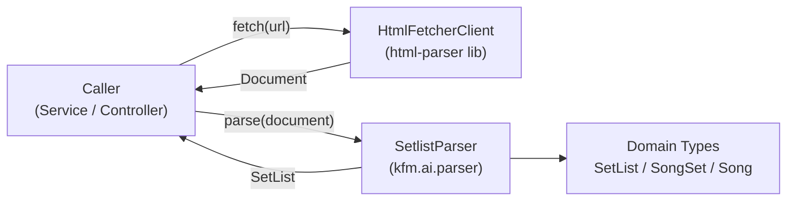

# Design Document: setlist-html-parser

## Overview

This feature adds a `SetlistParser` Spring component to `kfm-ai` that accepts a `org.jsoup.nodes.Document` (produced by the external `html-parser` library) representing a setlist.fm concert page and maps the parsed DOM into the existing `SetList → SongSet → Song` domain hierarchy. HTTP fetching and DOM construction are entirely delegated to the `html-parser` library; `SetlistParser` is solely responsible for domain extraction.

The parser extracts:
- Concert date from the `<time datetime="...">` element
- All set blocks (Set I, Set II, Encore, etc.) in DOM order, each becoming a `SongSet`
- All songs within each set block in DOM order, each becoming a `Song` with title, optional annotation, segue flag, and null lyrics

Song lyrics are out of scope for this feature; the `lyrics` field on `Song` will always be `null` from this parser.

---

## Architecture

### Component Flow



The caller (service or controller) is responsible for:
1. Invoking `HtmlFetcherClient.fetch(url)` to obtain a `Document`
2. Passing that `Document` to `SetlistParser.parse(document)`
3. Handling the returned `SetList`

`SetlistParser` never touches `HtmlFetcherClient` directly. This strict separation allows `SetlistParser` to be tested with synthetic `Document` instances constructed entirely in-memory using Jsoup, with no HTTP calls required.

### Package Structure

```
kfm-ai/
└── src/
    └── main/
        └── java/
            └── kfm/ai/
                ├── parser/
                │   ├── SetlistParser.java          ← new
                │   └── SetlistParseException.java  ← new
                └── types/
                    ├── SetList.java                ← modified (no new fields needed here)
                    ├── SongSet.java                ← modified (add: encore)
                    └── Song.java                   ← modified (add: annotation, segue)
```

---

## Components and Interfaces

### `SetlistParser`

**Package:** `kfm.ai.parser`  
**Stereotype:** `@Component`  
**Thread-safety:** Stateless — safe for concurrent use as a singleton bean

```java
package kfm.ai.parser;

import kfm.ai.types.SetList;
import org.jsoup.nodes.Document;
import org.springframework.stereotype.Component;

@Component
public class SetlistParser {

    /**
     * Parses a setlist.fm Document into the SetList domain hierarchy.
     *
     * @param document fully-parsed Jsoup Document from a setlist.fm page; must not be null
     * @return SetList populated with concert date, sets, and songs in DOM order
     * @throws IllegalArgumentException if document is null
     * @throws SetlistParseException    if the datetime element is missing or its value cannot be parsed
     */
    public SetList parse(Document document) { ... }

    // ── private helpers ──────────────────────────────────────────────
    private LocalDateTime parseDate(Document document);
    private List<SongSet> parseSets(Document document);
    private SongSet parseSet(Element setBlock, int ordinal);
    private List<Song> parseSongs(Element setBlock);
    private Song parseSong(Element songEntry);
    private boolean isEncore(String label);
    private String extractLabel(Element setBlock);
}
```

**Design decisions:**
- No constructor parameters — `SetlistParser` has no collaborators and no configuration. `@Component` with a no-arg constructor satisfies Requirement 6.1.
- All private helpers are package-private-testable through the public `parse()` entry point; no need to expose internals.
- The stateless design means no mutable fields are introduced, satisfying Requirement 6.3.

### `SetlistParseException`

**Package:** `kfm.ai.parser`  
**Supertype:** `RuntimeException` (unchecked)

```java
package kfm.ai.parser;

public class SetlistParseException extends RuntimeException {

    public SetlistParseException(String message) {
        super(message);
    }

    public SetlistParseException(String message, Throwable cause) {
        super(message, cause);
    }
}
```

Thrown in two situations:
- Missing `<time datetime>` element → message contains `"datetime"`
- Unparseable datetime value → message contains the raw attribute value

---

## Data Models

### Updated `Song`

```java
@Data @Builder @AllArgsConstructor @NoArgsConstructor
public class Song {

    /** Song title, trimmed; never contains annotation text or '>' segue marker. */
    private String title;

    /** Always null from this parser; populated by a future lyrics-sourcing feature. */
    private String lyrics;

    /**
     * Performance-specific note extracted from parenthetical text in the song entry,
     * excluding the surrounding parentheses. Null when no annotation is present.
     * Multiple parenthetical phrases are concatenated in DOM order separated by a single space.
     */
    private String annotation;

    /**
     * True when a '>' segue marker was present adjacent to this song entry,
     * indicating the music continued directly into the next song without stopping.
     */
    private boolean segue;
}
```

### Updated `SongSet`

```java
@Data @Builder @AllArgsConstructor @NoArgsConstructor
public class SongSet {

    /** 1-based position of this set in the concert. Encores continue the same sequence. */
    private int ordinal;

    /** Songs in this set, in DOM order. Never null; may be empty. */
    private List<Song> songs;

    /**
     * True when this set block was labeled as an encore (label matches ^Encore.* case-insensitively).
     * All sets (regular and encore) appear in the same songSets list in DOM order.
     */
    private boolean encore;
}
```

### `SetList` (unchanged fields)

```java
@Data @Builder @AllArgsConstructor @NoArgsConstructor
public class SetList {

    /** Concert date/time. Time portion is midnight (00:00) when only a date was encoded. */
    private LocalDateTime date;

    /** All sets in DOM order. Never null; may be empty. Encores are not in a separate list. */
    private List<SongSet> songSets;
}
```

---

## Jsoup CSS Selector Strategy

### setlist.fm DOM Structure (observed)

```
<time datetime="2026-06-05">June 5, 2026</time>

<div class="setlist-set">            ← set block
  <h2>Set 1</h2>                     ← set label (heading element)
  <ol>
    <li class="song">                ← song entry
      <a href="...">Truckin'</a>
      <span class="songInfo">        ← optional annotation container
        (First live performance since 2019)
      </span>
      <span class="segue">&gt;</span> ← optional segue marker
    </li>
    ...
  </ol>
</div>

<div class="setlist-set">
  <h2>Encore:</h2>
  <ol>
    <li class="song"><a>Casey Jones</a></li>
  </ol>
</div>
```

> **Note:** The exact CSS class names and element nesting must be validated against live setlist.fm pages during implementation. The selectors below represent the design intent based on observed structure; they should be confirmed and adjusted via page inspection before finalising the implementation.

### Selector Table

| Data point | Jsoup selector / approach |
|---|---|
| Concert date | `document.selectFirst("time[datetime]")` → `.attr("datetime")` |
| All set blocks | `document.select(".setlist-set")` (or equivalent container class) |
| Set label heading | `setBlock.selectFirst("h2, h3")` → `.text()` |
| Song entries | `setBlock.select("li.song")` (or `ol > li`) |
| Song anchor (title source) | `songEntry.selectFirst("a")` → `.text()` |
| Annotation text | `songEntry.select(".songInfo")` → text content inside parentheses, or text nodes following the `<a>` that match `\\(.*?\\)` pattern |
| Segue marker | `songEntry.selectFirst(".segue")` non-null check, or text node containing `>` |

### Date Parsing Logic

```
String raw = timeEl.attr("datetime");   // e.g. "2026-06-05" or "2026-06-05T20:00:00"
try {
    return raw.contains("T")
        ? LocalDateTime.parse(raw)
        : LocalDate.parse(raw).atStartOfDay();
} catch (DateTimeParseException e) {
    throw new SetlistParseException("Unparseable datetime value: " + raw, e);
}
```

### Song Text Extraction Logic

Each `<li>` song entry may contain:
1. An `<a>` element — the canonical song title source
2. Parenthetical text nodes or `<span>` elements — annotation
3. A `>` text node or `<span class="segue">` — segue indicator

**Algorithm:**
1. Extract title from the `<a>` element text, trimmed.
2. Collect all text fragments inside `(...)` patterns from the remaining element content → join with `" "` → annotation (null if none).
3. Check for `>` in text nodes or dedicated segue element → segue flag.
4. Explicitly ensure `>` and parenthetical text do not appear in the title field.

---

## Ordinal and Encore Assignment

Sets are numbered in a single pass over the ordered list of set blocks:

```
int ordinal = 1;
for (Element setBlock : setBlocks) {
    String label = extractLabel(setBlock);
    boolean encore = isEncore(label);        // label.matches("(?i)^Encore.*")
    SongSet set = SongSet.builder()
        .ordinal(ordinal++)
        .songs(parseSongs(setBlock))
        .encore(encore)
        .build();
    result.add(set);
}
```

The ordinal counter never resets; encores receive the next integer in sequence. An unrecognised label defaults to `encore = false`.

---

## Error Handling

| Condition | Behaviour |
|---|---|
| `document == null` | Throw `IllegalArgumentException("Document input must not be null")` |
| No `<time datetime>` element | Throw `SetlistParseException("Missing <time datetime> element in document")` |
| Datetime value is present but unparseable | Throw `SetlistParseException("Unparseable datetime value: " + raw, cause)` |
| Set block with no songs | Produce `SongSet` with empty (non-null) `songs` list |
| No set blocks in document | Return `SetList` with populated `date` and empty (non-null) `songSets` list |
| Set block with unrecognised label | Parse normally, assign next ordinal, set `encore = false` |

---

## Configuration Changes

### pom.xml

Add to `<dependencies>` (compile scope):

```xml
<dependency>
    <groupId>kfm</groupId>
    <artifactId>html-parser</artifactId>
    <version>0.0.1-SNAPSHOT</version>
</dependency>
```

The existing `jsoup` entry in `<dependencyManagement>` can remain for version pinning; it is now also provided transitively through `html-parser`.

### application.yaml

Add the `html-fetcher` stanza alongside the existing `spring` configuration:

```yaml
html-fetcher:
  base-url: https://www.setlist.fm
  connect-timeout: 5s
  read-timeout: 15s
  user-agent: kfm-ai/1.0
```

---

## Correctness Properties

*A property is a characteristic or behavior that should hold true across all valid executions of a system — essentially, a formal statement about what the system should do. Properties serve as the bridge between human-readable specifications and machine-verifiable correctness guarantees.*

### Property 1: Date extraction round-trip

*For any* valid date string (in `yyyy-MM-dd` or ISO datetime format), a synthetic Document built with that datetime attribute value, when parsed, SHALL produce a `SetList` whose `date` field encodes exactly the same calendar date, with the time portion set to midnight when no time component was present.

**Validates: Requirements 1.1, 1.2**

---

### Property 2: Invalid datetime strings produce SetlistParseException with value in message

*For any* string that is not a valid ISO date or datetime (e.g. random alphanumeric strings, empty strings, partial values), when a Document is built with that string as the `datetime` attribute and parsed, THE `SetlistParser` SHALL throw a `SetlistParseException` whose message contains that exact string.

**Validates: Requirements 1.4**

---

### Property 3: Set count invariant

*For any* synthetic Document containing N set blocks (N ≥ 0), parsing SHALL produce a `SetList` whose `songSets` list has exactly N elements.

**Validates: Requirements 2.1, 5.1, 4.2**

---

### Property 4: Song count invariant

*For any* synthetic Document where set block i contains K_i songs, the total song count across all `SongSet` objects in the parsed `SetList` SHALL equal the sum K_1 + K_2 + … + K_N.

**Validates: Requirements 2.2, 5.2**

---

### Property 5: Ordinal sequence is contiguous and gapless

*For any* synthetic Document containing N set blocks, the `ordinal` values of the resulting `SongSet` objects SHALL be exactly the set {1, 2, …, N} in DOM order, with no gaps, no duplicates, and no resets at encore boundaries.

**Validates: Requirements 3.1, 3.2, 5.3**

---

### Property 6: Encore flag matches label pattern

*For any* synthetic Document containing set blocks with arbitrary label strings, the `encore` field of each resulting `SongSet` SHALL be `true` if and only if the corresponding label matches `^Encore.*` (case-insensitive), and `false` for all other labels (including unrecognised ones).

**Validates: Requirements 3.3, 3.5, 5.4, 7.2, 7.3**

---

### Property 7: Song title is trimmed and excludes annotation and segue text

*For any* song entry whose source HTML title anchor contains surrounding whitespace, and/or whose entry contains annotation text in parentheses, and/or a `>` segue marker, the `title` field of the resulting `Song` SHALL equal the song name text with all leading/trailing whitespace removed and with no annotation text or `>` characters included.

**Validates: Requirements 2.3, 8.4, 9.4**

---

### Property 8: Annotation field matches source parenthetical text

*For any* song entry, the `annotation` field SHALL be non-null (and equal to the concatenated parenthetical content, without surrounding parentheses) if and only if at least one parenthetical phrase was present in the source entry. Multiple phrases SHALL be joined with a single space in DOM order.

**Validates: Requirements 5.5, 8.2, 8.3, 8.5**

---

### Property 9: Segue flag matches source marker

*For any* song entry, the `segue` field SHALL be `true` if and only if a `>` segue marker was present adjacent to that entry in the source HTML, regardless of whether a following song exists in the same set.

**Validates: Requirements 5.6, 9.2, 9.3, 9.5**

---

## Testing Strategy

### Approach

The parser operates purely on in-memory Jsoup `Document` objects — there are no database calls, no HTTP calls, and no external dependencies. This makes it an ideal candidate for both example-based unit tests and property-based tests, all running entirely in-process.

**Property-based testing library:** [jqwik](https://jqwik.net/) (Java PBT library integrating natively with JUnit 5, which the project already uses)

Add to `pom.xml` test scope:
```xml
<dependency>
    <groupId>net.jqwik</groupId>
    <artifactId>jqwik</artifactId>
    <version>1.9.3</version>
    <scope>test</scope>
</dependency>
```

Each property-based test is annotated `@Property` and configured with `tries = 100` (minimum). Test generators construct synthetic `Document` objects using `Jsoup.parse(html)` with randomly assembled HTML strings; no network access is needed.

Tag format for traceability: `// Feature: setlist-html-parser, Property N: <property_text>`

### Unit Tests (Example-Based)

Focus on concrete scenarios and error paths:

| Test | Scenario |
|---|---|
| `parse_null_document_throws` | `null` input → `IllegalArgumentException` with "Document input" |
| `parse_missing_datetime_throws` | Document with no `<time datetime>` → `SetlistParseException` with "datetime" |
| `parse_date_only_midnight` | `datetime="2024-05-10"` → `LocalDateTime` with `00:00:00` time |
| `parse_full_datetime` | `datetime="2024-05-10T20:30:00"` → correct `LocalDateTime` |
| `parse_empty_set_block` | Set block with no songs → `SongSet` with empty non-null `songs` |
| `parse_no_set_blocks` | Document with date but no sets → empty non-null `songSets` |
| `parse_null_lyrics` | Any parsed song → `lyrics == null` |
| `parse_last_song_segue` | Last song in set with `>` marker → `segue == true` |
| `parse_multiple_annotations` | Song with two parenthetical phrases → joined by single space |
| `parse_unrecognised_label` | Set block with unexpected label → `encore=false`, ordinal assigned |

### Property Tests

Each property test generates synthetic HTML Strings via jqwik `@Provide` arbitraries, parses with `Jsoup.parse()`, then invokes `setlistParser.parse()`.

| Property | Test class method |
|---|---|
| Property 1: Date round-trip | `dateRoundTrip()` — arbitrary valid date strings |
| Property 2: Invalid datetime → exception | `invalidDatetimeThrows()` — arbitrary non-date strings |
| Property 3: Set count invariant | `setCountMatchesBlocks()` — arbitrary N ≥ 0 set blocks |
| Property 4: Song count invariant | `songCountMatchesEntries()` — arbitrary N sets × M_i songs |
| Property 5: Ordinal sequence | `ordinalsAreContiguous()` — arbitrary N sets, mixed label types |
| Property 6: Encore flag | `encoreFlagMatchesLabel()` — arbitrary mixes of encore/regular labels |
| Property 7: Title cleanliness | `titleExcludesAnnotationAndSegue()` — arbitrary title, annotation, segue combinations |
| Property 8: Annotation extraction | `annotationMatchesParenthetical()` — arbitrary annotation text, optional presence |
| Property 9: Segue flag | `segueFlagMatchesMarker()` — arbitrary songs with/without `>` markers |

### Integration Tests

A minimal set of integration-style tests (1–2 examples each) should verify:
- Spring context loads with `SetlistParser` bean created successfully (no external deps required)
- `SetlistParser` injected into a `@SpringBootTest(webEnvironment = NONE)` context with Ollama and DB mocked/absent

These are smoke-level context tests, not property tests.
