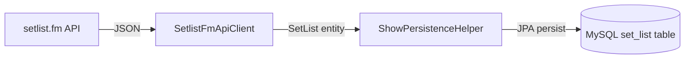

# Design Document: Venue Data Capture

## Overview

This feature extends the setlist ingest pipeline to capture venue location data (venue name, city, and state) from the setlist.fm API and persist it in the `set_list` table. The change touches four layers:

1. **Database** — A V2 Flyway migration adds three nullable columns
2. **Entity** — The `SetList` JPA entity gains corresponding fields
3. **API Records** — The `ApiVenue` record is extended with nested city deserialization
4. **Mapping** — The `mapToEntity()` method in `SetlistFmApiClient` populates the new fields

All changes are backward-compatible: existing rows retain NULL in the new columns, and the ingest pipeline gracefully handles absent/null venue data from the API.

## Architecture

The existing architecture remains unchanged. Data flows through:



The only modification is widening the data extracted at each stage to include venue fields.

## Components and Interfaces

### V2 Flyway Migration (`V2__add_venue_columns.sql`)

Adds three nullable columns to `set_list`:

```sql
ALTER TABLE set_list ADD COLUMN venue_name VARCHAR(255) NULL;
ALTER TABLE set_list ADD COLUMN city VARCHAR(255) NULL;
ALTER TABLE set_list ADD COLUMN state VARCHAR(100) NULL;
```

**Design Decision:** Columns are nullable to preserve backward compatibility with existing rows and to handle shows where the API provides no venue information.

### SetList Entity (`kfm.ai.types.SetList`)

New fields added to the existing entity:

```java
@Column(name = "venue_name")
private String venueName;

@Column(name = "city")
private String city;

@Column(name = "state", length = 100)
private String state;
```

No `nullable = false` constraint is applied, allowing JPA to persist null values without error.

### ApiVenue Record (extended)

The existing `ApiVenue` record currently contains only `id` and `name`. It will be extended with a nested `city` field:

```java
@JsonIgnoreProperties(ignoreUnknown = true)
public record ApiVenue(String id, String name, ApiCity city) {}

@JsonIgnoreProperties(ignoreUnknown = true)
public record ApiCity(String name, String state, String stateCode) {}
```

Jackson's `@JsonIgnoreProperties(ignoreUnknown = true)` ensures that missing or extra fields in the API response are handled gracefully without exceptions.

### Mapping Logic in `SetlistFmApiClient.mapToEntity()`

After constructing the `SetList` entity, the method applies venue field mapping:

```java
// Venue mapping
String venueName = null;
String cityName = null;
String state = null;

if (apiSetlist.venue() != null) {
    String rawName = apiSetlist.venue().name();
    if (rawName != null && !rawName.isBlank()) {
        venueName = rawName.length() > 512 ? rawName.substring(0, 512) : rawName;
    }

    ApiCity apiCity = apiSetlist.venue().city();
    if (apiCity != null) {
        if (apiCity.name() != null && !apiCity.name().isBlank()) {
            cityName = apiCity.name();
        }
        // Prefer stateCode; fall back to state name
        if (apiCity.stateCode() != null && !apiCity.stateCode().isBlank()) {
            state = apiCity.stateCode();
        } else if (apiCity.state() != null && !apiCity.state().isBlank()) {
            state = apiCity.state();
        }
    }
}
```

**Design Decisions:**
- **Truncation at 512 characters** for venue name as specified in requirements (column is VARCHAR(255) but requirement states truncation at 512 — the entity will use `@Column(length = 512)` or the column will be widened to accommodate; per requirement 4.1, truncation is at 512 chars).
- **`isBlank()` check** treats whitespace-only values as absent (requirement 4.6).
- **stateCode preferred over state name** provides a normalized, shorter representation when available (requirement 4.3).

**Note on Column Width vs Truncation:** Requirement 1.1 specifies VARCHAR(255) for `venue_name` while requirement 4.1 specifies truncation at 512 characters. Since most venue names are well under 255 characters, this design will use VARCHAR(512) for the `venue_name` column to align the truncation boundary with the column width, avoiding silent data truncation by MySQL.

## Data Models

### Database Schema (post-migration)

| Column | Type | Nullable | Notes |
|--------|------|----------|-------|
| id | BIGINT AUTO_INCREMENT | NO | Primary key |
| date | DATETIME(6) | NO | Show date |
| source_url | VARCHAR(2048) | NO | Unique setlist.fm URL |
| venue_name | VARCHAR(512) | YES | Venue name from API |
| city | VARCHAR(255) | YES | City name from API venue.city.name |
| state | VARCHAR(100) | YES | stateCode (preferred) or state name |

### API Response Shape (relevant portion)

```json
{
  "venue": {
    "id": "23d63a87",
    "name": "Red Rocks Amphitheatre",
    "city": {
      "name": "Morrison",
      "state": "Colorado",
      "stateCode": "CO"
    }
  }
}
```

### Entity Field Mapping

| API Path | Entity Field | Null Handling |
|----------|-------------|---------------|
| `venue.name` | `venueName` | Null/blank → null |
| `venue.city.name` | `city` | Null/blank/absent city → null |
| `venue.city.stateCode` | `state` | Null/blank → fall back to `venue.city.state`; both null → null |

## Correctness Properties

*A property is a characteristic or behavior that should hold true across all valid executions of a system — essentially, a formal statement about what the system should do. Properties serve as the bridge between human-readable specifications and machine-verifiable correctness guarantees.*

### Property 1: Venue Field Persistence Round-Trip

*For any* valid SetList entity with non-null venue fields (venueName, city, state containing arbitrary non-blank strings within column length limits), persisting the entity and then loading it by ID SHALL return an entity with identical venueName, city, and state values.

**Validates: Requirements 2.5**

### Property 2: API Venue Deserialization Completeness

*For any* JSON object containing a venue with an arbitrarily structured city sub-object (with any combination of present/absent/null `name`, `state`, `stateCode` fields), deserializing into `ApiVenue` SHALL produce a record where each present non-null field is accessible and each absent/null field is null, without throwing an exception.

**Validates: Requirements 3.1, 3.2, 3.3, 3.4**

### Property 3: Venue Field Mapping Correctness

*For any* API response containing a venue with a non-blank name and a city object with a non-blank city name, the `mapToEntity()` method SHALL produce a SetList entity where `venueName` equals the venue name (truncated to 512 characters if longer) and `city` equals the city name. When the venue name or city name is null, blank, or whitespace-only, the corresponding entity field SHALL be null.

**Validates: Requirements 4.1, 4.2, 4.4, 4.5, 4.6**

### Property 4: State Field Fallback Logic

*For any* API response containing venue city data, the `mapToEntity()` method SHALL set the `state` field to `stateCode` when stateCode is non-blank, otherwise to `state` when state is non-blank, otherwise to null. Whitespace-only values are treated as blank.

**Validates: Requirements 4.3, 4.6**

## Error Handling

| Scenario | Handling |
|----------|----------|
| API returns no `venue` object | All venue fields set to null; entity persists normally |
| API returns venue with null/blank `name` | `venueName` set to null |
| API returns venue with null `city` | `city` and `state` fields set to null |
| Venue name exceeds 512 characters | Truncated to 512 characters |
| JSON deserialization of unknown fields | Ignored via `@JsonIgnoreProperties(ignoreUnknown = true)` |
| Existing rows loaded with null venue columns | Entity loads normally with null fields (no `@Column(nullable = false)`) |

No new exceptions are introduced. The mapping logic defensively produces null values rather than throwing, consistent with the existing `mapToEntity()` pattern that returns `null` for unparseable dates.

## Testing Strategy

### Property-Based Tests (jqwik)

The project already uses jqwik for property-based testing. Each correctness property maps to a dedicated property test class:

| Property | Test Class | Approach |
|----------|-----------|----------|
| 1: Persistence round-trip | `VenueFieldPersistenceRoundTripPropertyTest` | Generate random strings for venue fields, persist via `SetListRepository`, reload, assert equality. Uses Testcontainers MySQL. |
| 2: Deserialization | `ApiVenueDeserializationPropertyTest` | Generate random JSON with varying city structures, deserialize with Jackson `ObjectMapper`, verify field accessibility and null safety. |
| 3: Field mapping | `VenueFieldMappingPropertyTest` | Generate random `ApiSetlist` objects with varying venue/city data, call `mapToEntity()`, assert venueName and city populated correctly with truncation and null handling. |
| 4: State fallback | `VenueStateFieldFallbackPropertyTest` | Generate `ApiCity` objects with varying state/stateCode combinations, verify correct priority. Can be combined with Property 3 if desired. |

**Configuration:**
- Minimum 100 iterations per property (`@Property(tries = 100)`)
- Each test tagged: `// Feature: venue-data-capture, Property N: <title>`

### Unit Tests

- Migration file validation: verify SQL contains only additive ALTER TABLE statements
- Edge cases: empty string, whitespace-only, extremely long venue names (boundary at 512)

### Integration Tests

- Flyway migration applied to a database with existing rows preserves data
- End-to-end ingest with mock API returning venue data; verify persisted entity has correct venue fields
- End-to-end ingest with mock API returning no venue data; verify null venue fields

### Test Library

- **Property testing:** `net.jqwik:jqwik:1.9.3` (already in pom.xml)
- **Mocking:** Mockito (via `spring-boot-starter-test`)
- **Integration:** Testcontainers MySQL (already configured)
